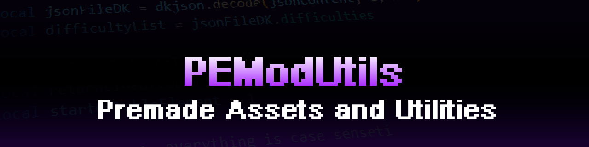

# PEModUtils



A repository containing various premade assets available to use for [Psych Engine](https://github.com/ShadowMario/FNF-PsychEngine) or any engines built off it.

* Engine Specific Utilities - Anything specific to one engine or another.
* LUA Stage Recreations - Stage Recreations made in LUA.
* Utilities - Utilities made for a variety of use cases.

If you have issues working with something in this repository, open an issue!

## How to Use

### Utilities

To use an utility, simply use `require()` to load the module and all its child functions and variables.

```lua
local onlineutil = require(currentModDirectory .. '/onlineutil')

local apicompatibleutil = require(currentModDirectory .. '/apiocmpatibleutil')
local fileutil = require(currentModDirectory .. '/fileutil')
local modutil = require(currentModDirectory .. '/modutil')
```

Make sure to place the .lua files in their correct place. Refer to the DOC_ files or the wiki for documentation of utilites.

### LUA Stage Recreations

Place the associated .json and .lua file into the stages folder of a mod to use.

## Licensing and Usage

This utility is free software; you can redistribute it and/or modify it under the terms of the MIT license. See [LICENSE](LICENSE) for details.

Credit is optional, but I highly appreciate it!
